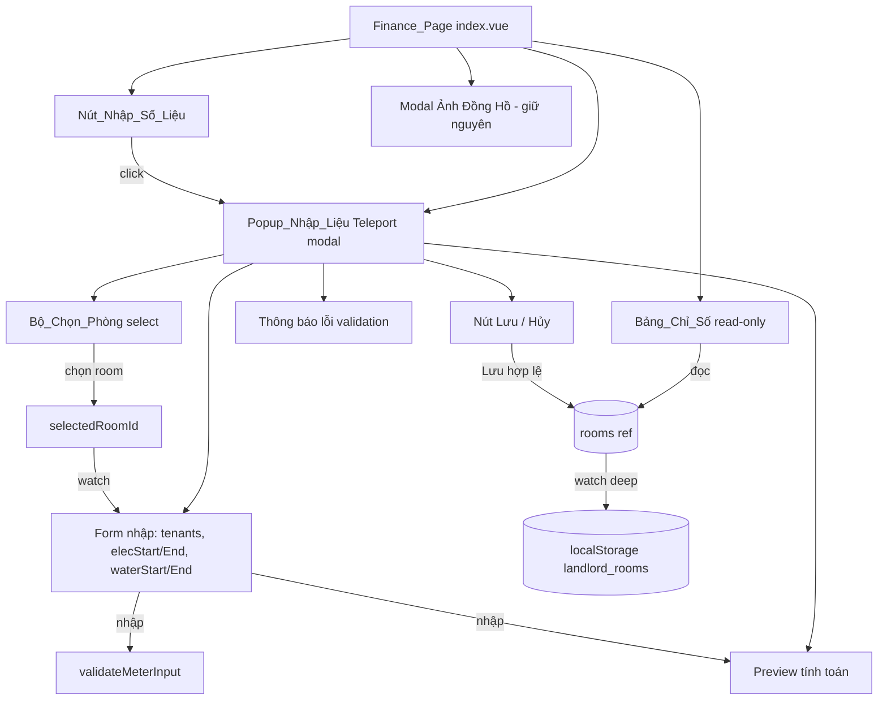
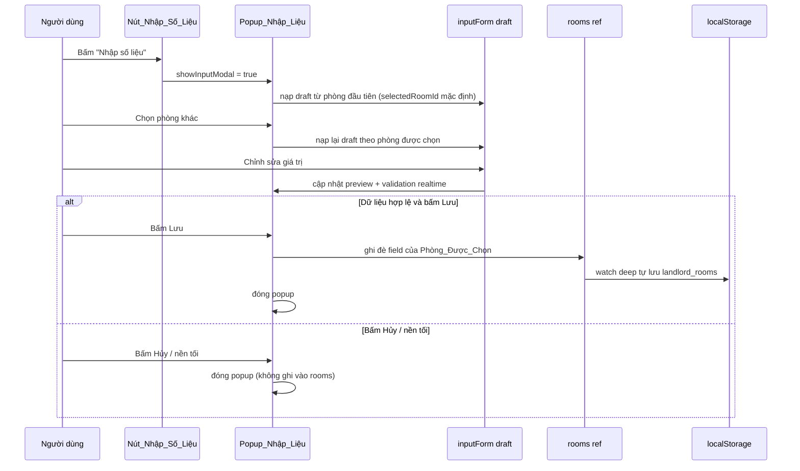

# Design Document

## Overview

Tính năng này chuyển bảng "Nhập Chỉ Số Điện / Nước & Tính Tiền" trên trang `resources/js/Pages/Landlord/Finance/index.vue` từ chế độ nhập inline sang chế độ **chỉ đọc**, và đưa toàn bộ thao tác nhập liệu vào một **Popup_Nhập_Liệu (Input_Modal)** duy nhất, mở bằng nút **"Nhập số liệu"** đặt ở đầu bảng.

Phạm vi thay đổi nằm hoàn toàn ở frontend (một Single File Component duy nhất). Dữ liệu tiếp tục được lưu ở `localStorage` dưới khóa `landlord_rooms`, không có thay đổi backend, không thêm route, không thêm controller.

Các quyết định thiết kế chính:

- **Tái sử dụng mẫu modal hiện có**: Popup_Nhập_Liệu dùng cùng mẫu `Teleport to="body"` + lớp phủ `.modal-overlay` + `@click.self` để đóng, giống hệt modal "Ảnh Đồng Hồ" đang có trong file. Điều này giữ sự nhất quán về giao diện và hành vi (đóng khi bấm nền tối) mà không cần thêm phụ thuộc. Component dùng chung `Modal.vue` không được chọn vì modal hiện tại trong trang đã dùng style scoped riêng (`.modal-overlay`, `.meter-modal`) và việc dùng lại mẫu này giảm rủi ro lệch giao diện.
- **Tách logic thuần khỏi UI**: Các phép tính (tiêu thụ, tiền điện, tiền nước, tổng) và logic kiểm tra hợp lệ được biểu diễn dưới dạng **hàm thuần (pure functions)** nhận đầu vào và trả về kết quả xác định, không phụ thuộc trạng thái Vue. Điều này giúp tái sử dụng cho cả bảng (hiển thị), preview trong popup, và kiểm thử tự động.
- **Một nguồn sự thật (single source of truth)**: `rooms` (ref) vẫn là nguồn dữ liệu duy nhất. Popup chỉnh sửa trên một bản nháp (draft) riêng và chỉ ghi đè vào `rooms` khi người dùng bấm Lưu với dữ liệu hợp lệ. Nhờ đó, hủy bỏ không làm thay đổi dữ liệu.
- **Giữ nguyên cơ chế persistence**: `watch(rooms, ... , { deep: true })` hiện có sẽ tự động ghi xuống `localStorage` mỗi khi `rooms` thay đổi, nên việc lưu chỉ cần cập nhật `rooms`.

## Architecture

### Cấu trúc tổng thể của trang



### Luồng dữ liệu khi nhập liệu



### Phân lớp logic

| Lớp | Trách nhiệm | Hình thức |
|-----|-------------|-----------|
| Lớp tính toán | Tính tiêu thụ, tiền điện, tiền nước, tổng | Hàm thuần `calcElec`, `calcWater`, `calcTotal`, `consumption` |
| Lớp kiểm tra hợp lệ | Xác định form hợp lệ hay không và sinh thông báo lỗi | Hàm thuần `validateMeterInput` |
| Lớp trạng thái UI | Quản lý mở/đóng popup, phòng được chọn, draft nhập liệu | `ref` / `reactive` + `computed` + `watch` |
| Lớp persistence | Đọc/ghi `localStorage` | `watch(rooms, ...)` hiện có (giữ nguyên) |

## Components and Interfaces

Toàn bộ thay đổi nằm trong `resources/js/Pages/Landlord/Finance/index.vue`. Không tạo file component mới (giữ đồng nhất với mẫu modal "Ảnh Đồng Hồ" cùng file).

### 1. Bảng_Chỉ_Số (read-only)

Thay các ô `<input type="number" v-model.number="...">` trong các cột Số người, Điện (Số cũ/Số mới), Nước (Số cũ/Số mới) bằng văn bản chỉ đọc.

Trước (inline editable):
```html
<td class="td-center"><input type="number" v-model.number="room.tenants" class="num-input" min="1" /></td>
...
<td><input type="number" v-model.number="room.elecStart" class="num-input" /></td>
<td><input type="number" v-model.number="room.elecEnd" class="num-input" /></td>
```

Sau (read-only):
```html
<td class="td-center">{{ room.tenants }}</td>
...
<td class="td-center">{{ room.elecStart }}</td>
<td class="td-center">{{ room.elecEnd }}</td>
```

Các cột tính toán (Tiêu thụ, Tiền điện, Tiền nước, Tổng) và cấu trúc cột giữ nguyên như hiện tại; chúng đã dùng hàm `calc*` nên tự cập nhật khi `rooms` thay đổi.

### 2. Nút_Nhập_Số_Liệu

Đặt trong `.fin-card-head` (khu vực tiêu đề card chứa bảng), bên cạnh nút "Xuất Báo Cáo" hiện có.

```html
<div class="fin-card-head">
    <h3 class="fin-title"><i class="bi bi-table"></i> Nhập Chỉ Số Điện / Nước & Tính Tiền</h3>
    <div class="fin-head-actions">
        <button class="btn-input-data" @click="openInputModal">
            <i class="bi bi-pencil-square"></i> Nhập số liệu
        </button>
        <button class="btn-export"><i class="bi bi-file-earmark-pdf"></i> Xuất Báo Cáo</button>
    </div>
</div>
```

### 3. Popup_Nhập_Liệu (Input_Modal)

Dùng mẫu `Teleport to="body"` + `.modal-overlay` + `@click.self="cancelInput"`.

Bố cục:
- **Header**: tiêu đề "Nhập số liệu" + nút đóng (X).
- **Bộ_Chọn_Phòng**: `<select v-model="selectedRoomId">` với `<option>` cho mỗi phòng (`:value="room.id"`, hiển thị `{{ room.name }}`).
- **Form nhập**: 5 ô `<input type="number">` cho `tenants`, `elecStart`, `elecEnd`, `waterStart`, `waterEnd`, bound vào `inputForm` (draft).
- **Preview**: hiển thị `previewElecConsumption`, `previewWaterConsumption`, `previewElecCost`, `previewWaterCost`, `previewTotal`.
- **Thông báo lỗi**: danh sách `validation.errors` (hiển thị khi có lỗi).
- **Footer**: nút "Hủy" (`@click="cancelInput"`) và nút "Lưu" (`@click="saveInput"`, `:disabled="!validation.valid"`).

### 4. Giao diện hàm/biến (script setup)

```js
// ── Hàm thuần: tính toán (tổng quát hóa, nhận object có các field cần thiết) ──
const consumption = (start, end) => end - start
const calcElec  = (r) => (r.elecEnd - r.elecStart) * r.elecPrice
const calcWater = (r) => (r.waterEnd - r.waterStart) * r.waterPrice
const calcTotal = (r) => r.rent + calcElec(r) + calcWater(r)

// ── Hàm thuần: kiểm tra hợp lệ ──
// form: { tenants, elecStart, elecEnd, waterStart, waterEnd } (giá trị thô từ input)
// trả về: { valid: boolean, errors: string[] }
const validateMeterInput = (form) => { /* ... */ }

// ── Trạng thái Popup ──
const showInputModal = ref(false)
const selectedRoomId = ref(null)
const inputForm = reactive({ tenants: null, elecStart: null, elecEnd: null, waterStart: null, waterEnd: null })

// ── Dẫn xuất ──
const selectedRoom = computed(() => rooms.value.find(r => r.id === selectedRoomId.value) || null)
const validation   = computed(() => validateMeterInput(inputForm))
const previewCandidate = computed(() => ({ ...selectedRoom.value, ...numeric(inputForm) }))
const previewElecCost  = computed(() => calcElec(previewCandidate.value))
const previewWaterCost = computed(() => calcWater(previewCandidate.value))
const previewTotal     = computed(() => calcTotal(previewCandidate.value))

// ── Hành vi ──
const loadFormFromRoom = (room) => { /* gán inputForm = giá trị hiện tại của room */ }
const openInputModal = () => { selectedRoomId.value = rooms.value[0]?.id; showInputModal.value = true }
const cancelInput    = () => { showInputModal.value = false }
const saveInput      = () => { /* nếu valid: ghi đè field của selectedRoom rồi đóng */ }

watch(selectedRoomId, () => { if (selectedRoom.value) loadFormFromRoom(selectedRoom.value) })
```

Ghi chú: `calcElec`/`calcWater`/`calcTotal` đã tồn tại trong file và nhận một `room`. Vì `previewCandidate` là một object có đầy đủ `elecPrice`, `waterPrice`, `rent` (kế thừa từ `selectedRoom`) cùng các giá trị nhập mới, các hàm này tái sử dụng được nguyên vẹn cho preview — không cần viết lại logic tính tiền.

## Data Models

### Room (không đổi)

Mô hình `Phòng` giữ nguyên cấu trúc hiện tại, lưu trong mảng `rooms` và `localStorage` khóa `landlord_rooms`:

```js
{
  id: string,          // 'P101'
  name: string,        // 'Phòng 101'
  tenants: number,     // số người (>= 1)
  rent: number,        // tiền phòng
  elecStart: number,   // chỉ số điện cũ
  elecEnd: number,     // chỉ số điện mới (>= elecStart)
  waterStart: number,  // chỉ số nước cũ
  waterEnd: number,    // chỉ số nước mới (>= waterStart)
  elecPrice: number,   // đơn giá điện
  waterPrice: number,  // đơn giá nước
  status: string       // 'paid' | 'pending' | 'overdue'
}
```

### InputForm (draft, mới)

Trạng thái nháp tạm trong Popup_Nhập_Liệu; chỉ ghi vào `Room` khi lưu hợp lệ:

```js
{
  tenants: number | null,
  elecStart: number | null,
  elecEnd: number | null,
  waterStart: number | null,
  waterEnd: number | null
}
```

Chỉ 5 trường người dùng nhập được đưa vào draft. Các trường `rent`, `elecPrice`, `waterPrice`, `status`, `id`, `name` không bị popup thay đổi và lấy trực tiếp từ `Phòng_Được_Chọn`.

### ValidationResult (mới)

Kết quả của `validateMeterInput`:

```js
{
  valid: boolean,       // true khi không có lỗi
  errors: string[]      // danh sách thông báo lỗi tiếng Việt để hiển thị
}
```

Quy tắc hợp lệ (Requirement 7):
- Mọi trường `tenants`, `elecStart`, `elecEnd`, `waterStart`, `waterEnd` phải là số hợp lệ, không để trống.
- `tenants >= 1`.
- `elecEnd >= elecStart`.
- `waterEnd >= waterStart`.

## Correctness Properties

*A property is a characteristic or behavior that should hold true across all valid executions of a system — essentially, a formal statement about what the system should do. Properties serve as the bridge between human-readable specifications and machine-verifiable correctness guarantees.*

Phần này áp dụng property-based testing cho **lớp logic thuần** của tính năng (tính toán, kiểm tra hợp lệ, nạp/ghi dữ liệu, round-trip persistence). Các yêu cầu thuần về bố cục/hiển thị giao diện (bảng chỉ đọc, sự hiện diện của nút, số lượng ô nhập) được kiểm thử bằng ví dụ/snapshot trong phần Testing Strategy, không phải bằng property.

Sau bước reflection, các tiêu chí đã được hợp nhất: 3.1+3.2 (một property danh sách lựa chọn phòng), 3.4+4.2 (một property nạp form theo phòng), 7.1+7.2+7.3+7.4+4.4 (một property kiểm tra hợp lệ toàn diện), 6.1+6.2 (một property hủy không đổi dữ liệu). Tiêu chí 5.2 được bao hàm bởi Property 1 + Property 2; tiêu chí 6.3 được bao hàm bởi Property 8 + Property 4.

### Property 1: Bất biến tính tiền

*For any* Phòng với các trường số hợp lệ, các giá trị tính toán phải thỏa quan hệ định nghĩa: `Tiêu_Thụ_Điện = elecEnd - elecStart`, `Tiêu_Thụ_Nước = waterEnd - waterStart`, `Tiền_Điện = Tiêu_Thụ_Điện × elecPrice`, `Tiền_Nước = Tiêu_Thụ_Nước × waterPrice`, và `Tổng = rent + Tiền_Điện + Tiền_Nước`.

**Validates: Requirements 1.4, 5.2**

### Property 2: Preview khớp với giá trị sau khi lưu (metamorphic)

*For any* Phòng_Được_Chọn và *for any* bộ giá trị nhập hợp lệ trong Popup_Nhập_Liệu, các giá trị xem trước (Tiêu_Thụ_Điện, Tiêu_Thụ_Nước, Tiền_Điện, Tiền_Nước, Tổng) phải bằng đúng các giá trị mà Bảng_Chỉ_Số sẽ tính ra cho Phòng đó sau khi lưu cùng bộ giá trị đó.

**Validates: Requirements 4.3, 5.2**

### Property 3: Danh sách chọn phòng phản ánh đầy đủ danh sách phòng

*For any* danh sách Phòng, Bộ_Chọn_Phòng phải chứa đúng một lựa chọn cho mỗi Phòng (số lựa chọn bằng số Phòng, giá trị lựa chọn tương ứng `id` từng Phòng) và nhãn của mỗi lựa chọn phải bằng `name` của Phòng tương ứng.

**Validates: Requirements 3.1, 3.2**

### Property 4: Phòng đầu tiên được chọn mặc định khi mở popup

*For any* danh sách Phòng không rỗng, khi Popup_Nhập_Liệu mở, `selectedRoomId` phải bằng `id` của Phòng đầu tiên trong danh sách.

**Validates: Requirements 3.3**

### Property 5: Nạp form theo Phòng_Được_Chọn

*For any* danh sách Phòng và *for any* Phòng trong danh sách, khi Phòng đó được chọn trong Bộ_Chọn_Phòng, các ô nhập (`tenants`, `elecStart`, `elecEnd`, `waterStart`, `waterEnd`) phải được điền đúng bằng giá trị hiện tại tương ứng của Phòng đó.

**Validates: Requirements 3.4, 4.2**

### Property 6: Kiểm tra hợp lệ toàn diện

*For any* bộ giá trị nhập trong Popup_Nhập_Liệu, kết quả kiểm tra `valid` phải bằng `true` *khi và chỉ khi* tất cả các điều kiện sau đồng thời thỏa: mọi trường (`tenants`, `elecStart`, `elecEnd`, `waterStart`, `waterEnd`) là số hợp lệ và không để trống, `tenants ≥ 1`, `elecEnd ≥ elecStart`, và `waterEnd ≥ waterStart`. Trong mọi trường hợp `valid = false`, thao tác lưu không được làm thay đổi dữ liệu Phòng.

**Validates: Requirements 4.4, 7.1, 7.2, 7.3, 7.4**

### Property 7: Lưu cập nhật đúng các trường của Phòng_Được_Chọn

*For any* Phòng_Được_Chọn và *for any* bộ giá trị nhập hợp lệ, sau khi lưu, năm trường `tenants`, `elecStart`, `elecEnd`, `waterStart`, `waterEnd` của Phòng phải bằng đúng giá trị đã nhập, trong khi các trường không thuộc form (`rent`, `elecPrice`, `waterPrice`, `status`, `id`, `name`) và mọi Phòng khác giữ nguyên không đổi.

**Validates: Requirements 5.1**

### Property 8: Hủy nhập liệu không làm thay đổi dữ liệu

*For any* danh sách Phòng và *for any* chuỗi chỉnh sửa trên các ô nhập, nếu người dùng đóng/hủy Popup_Nhập_Liệu (bằng nút hủy, nút đóng, hoặc bấm vùng nền tối) thì toàn bộ danh sách Phòng phải giữ nguyên đúng như trước khi mở popup.

**Validates: Requirements 6.1, 6.2, 6.3**

### Property 9: Bất biến các chỉ số tổng hợp

*For any* danh sách Phòng, `Tổng dự kiến (totalRevenue)` phải bằng tổng `Tổng` của tất cả các Phòng; `Đã thu (totalCollected)` phải bằng tổng `Tổng` của các Phòng có `status = 'paid'`; `Còn nợ (totalDebt)` phải bằng tổng `Tổng` của các Phòng còn lại; và phải luôn có `totalCollected + totalDebt = totalRevenue`.

**Validates: Requirements 5.3**

### Property 10: Round-trip lưu trữ cục bộ

*For any* danh sách Phòng sau khi lưu thành công, việc đọc và phân tích (`JSON.parse`) dữ liệu ở khóa `landlord_rooms` trong `localStorage` phải cho ra một danh sách Phòng bằng đúng (deep-equal) danh sách Phòng hiện tại trong ứng dụng.

**Validates: Requirements 5.4**

## Error Handling

Tính năng không có lệnh gọi mạng hay backend, nên xử lý lỗi tập trung ở phía client:

- **Dữ liệu nhập không hợp lệ (Requirement 7)**: `validateMeterInput` trả về `{ valid, errors }`. Khi `valid = false`:
  - Popup_Nhập_Liệu hiển thị danh sách `errors` (thông báo tiếng Việt cụ thể cho từng vi phạm: điện mới < điện cũ, nước mới < nước cũ, số người < 1, ô trống/không phải số).
  - Nút "Lưu" bị vô hiệu hóa (`:disabled="!validation.valid"`) và `saveInput` thoát sớm nếu được gọi khi không hợp lệ, đảm bảo không ghi vào `rooms`.
- **`localStorage` không khả dụng / dữ liệu hỏng**: Khi khởi tạo, bao bọc `JSON.parse(localStorage.getItem('landlord_rooms'))` trong `try/catch`; nếu lỗi hoặc dữ liệu không hợp lệ thì fallback về `DEFAULT_ROOMS` (giữ hành vi hiện tại, tránh trang trắng). Việc ghi `localStorage` cũng nên được bọc `try/catch` để lỗi quota không làm hỏng luồng UI.
- **Danh sách phòng rỗng**: Nếu `rooms` rỗng, `openInputModal` không có phòng để chọn; nút "Nhập số liệu" có thể bị vô hiệu hóa hoặc popup hiển thị trạng thái rỗng. Với dữ liệu mặc định hiện tại điều này không xảy ra, nhưng thiết kế cần xử lý phòng hờ để tránh lỗi `undefined`.
- **Ép kiểu số**: Các ô dùng `type="number"` + `v-model.number`. Giá trị trống cho ra `null`/chuỗi rỗng; `validateMeterInput` coi các trường hợp này là không hợp lệ (dùng `Number.isFinite` sau khi ép kiểu) thay vì để `NaN` lan vào phép tính.

## Testing Strategy

### Phương pháp kép

- **Property-based tests**: kiểm chứng 10 property phổ quát ở trên trên lớp logic thuần (tính toán, validation, nạp/ghi form, aggregates, round-trip persistence). Đây là nơi biến thiên đầu vào (chỉ số, đơn giá, số phòng, dữ liệu nhập biên) phát hiện nhiều lỗi nhất.
- **Unit/Example & component tests**: kiểm chứng các yêu cầu giao diện và tương tác cụ thể không phù hợp với PBT:
  - 1.1, 1.2, 1.3, 1.5: bảng hiển thị chỉ đọc (không còn `<input>` inline) và giữ đủ các cột.
  - 2.1, 2.2, 2.3: có đúng một nút "Nhập số liệu"; bấm nút mở popup; các hành động dòng và nút Ảnh Đồng Hồ vẫn còn.
  - 4.1: popup hiển thị đủ 5 ô nhập khi đã chọn phòng.
  - 5.5: lưu thành công thì popup đóng.

### Thiết lập công cụ kiểm thử

Hiện dự án (`package.json`) chỉ có script `dev`/`build`, chưa có test runner. Để hiện thực hóa chiến lược trên cần bổ sung:

- **Test runner**: **Vitest** (tích hợp tốt với Vite đang dùng).
- **Component testing**: **@vue/test-utils** + môi trường **jsdom** (cho `localStorage`, DOM, render component).
- **Property-based testing**: **fast-check** (thư viện PBT chuẩn cho hệ JavaScript/TypeScript). **Không tự cài đặt PBT từ đầu** — dùng generator/`fc.assert`/`fc.property` của fast-check.

Cần thêm script `test` (ví dụ `vitest --run`) và chạy ở chế độ chạy một lần (không watch).

### Yêu cầu cho property tests

- Mỗi property dùng **một** property-based test tương ứng (Property 1 → 1 test, …).
- Mỗi test chạy **tối thiểu 100 vòng lặp** (cấu hình `numRuns: 100` của fast-check).
- Mỗi test gắn nhãn tham chiếu tới property trong tài liệu thiết kế, định dạng:
  `// Feature: finance-meter-input-popup, Property {number}: {property_text}`
- **Generators** cần bao phủ các ca biên: chỉ số `start`/`end` bằng nhau và lệch nhau theo cả hai chiều, `tenants` quanh ngưỡng 1 (0, 1, âm), trường trống/không phải số, ký tự đặc biệt/Unicode trong `name`, danh sách phòng rỗng và nhiều phòng, đơn giá và rent ở biên (0, lớn).

### Để tách logic khỏi Vue cho dễ kiểm thử

Trích các hàm thuần (`consumption`, `calcElec`, `calcWater`, `calcTotal`, `validateMeterInput`, hàm dựng candidate cho preview, hàm áp draft vào room) sao cho có thể import và test độc lập với component. Các property về aggregate (Property 9), nạp form (Property 5), lưu (Property 7), hủy (Property 8) và round-trip (Property 10) có thể test ở mức logic/thành phần với `localStorage` của jsdom; các property về danh sách chọn phòng (Property 3) và mặc định chọn (Property 4) test ở mức component mounted.
