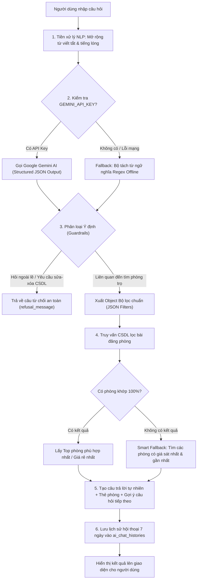

# TÀI LIỆU CHI TIẾT: LUỒNG VÀ CÁCH HOẠT ĐỘNG CỦA AI GỢI Ý & TÌM KIẾM PHÒNG TRỌ
**Hệ thống**: Ninh Bình HomeStay (Ninh Bình StayWork)  
**Ngày cập nhật**: 20/08/2026  

---

## 1. TỔNG QUAN HỆ THỐNG
Tính năng **AI Gợi ý & Tìm kiếm phòng trọ** cho phép khách thuê tương tác bằng ngôn ngữ tự nhiên (tiếng Việt đời thường, bao gồm cả từ viết tắt, tiếng lóng tìm trọ) để tìm phòng phù hợp nhất tại Ninh Bình. 

Hệ thống được áp dụng tại 3 điểm chạm chính:
1. **Thanh tìm kiếm AI** tại trang Tìm trọ (`/timtro`).
2. **Trợ lý Trò chuyện AI (Chatbot Popup)** ở góc phải màn hình (`AiChatAssistant.vue`).
3. **AI Gợi ý phòng thay thế tự động** khi khách thuê đánh giá "Không ưng" sau khi đi xem phòng trong Lịch hẹn (`/lichhen`).

---

## 2. KIẾN TRÚC TỔNG THỂ & CÁC THÀNH PHẦN

```
[ Frontend (Vue.js / Inertia) ]
 ├── AiChatAssistant.vue (Popup Chatbot AI)
 ├── timtro.vue (Thanh tìm kiếm AI & Bộ lọc)
 └── lichhen.vue (Gợi ý 3 phòng khi Không ưng lịch hẹn)
         │  (Gửi request: /api/ai/chat, /timtro?ai_prompt=..., /appointments/{id}/feedback)
         ▼
[ Controller ]
 └── PublicListingController.php
         │  (Gọi các Service xử lý nghiệp vụ)
         ▼
[ Services Layer ]
 ├── AiRoomSearchService.php (Tiền xử lý NLP, Gọi Gemini AI / Regex Fallback, Guardrails)
 └── PublicListingService.php (Truy vấn CSDL, Thuật toán xếp hạng, Gợi ý phòng sát nhất)
         │
         ▼
[ Database (MySQL) ]
 ├── room_posts, rooms, boarding_houses, floors
 ├── amenities, services, areas, categories
 └── ai_chat_histories (Lưu lịch sử chat 7 ngày)
```

---

## 3. CÁC ACTOR TRONG HỆ THỐNG VÀ CÁCH TƯƠNG TÁC VỚI AI

Hệ thống có **5 Actor chính** tham gia vào vòng đời tương tác với tính năng AI:

```
┌─────────────────────────┐         ┌──────────────────────────┐
│  1. Khách vãng lai      │         │ 2. Khách thuê đăng nhập  │
│  (Guest / Chưa Login)   │         │ (Authenticated Tenant)   │
└────────────┬────────────┘         └────────────┬─────────────┘
             │                                   │
             │   Hỏi đáp / Tìm phòng tự nhiên    │  Chat, Đặt lịch hẹn,
             │   Lưu tạm localStorage           │  Nhận 3 gợi ý khi "Không ưng"
             ▼                                   ▼
┌──────────────────────────────────────────────────────────────┐
│        5. HỆ THỐNG TRỢ LÝ AI (Gemini + Regex Engine)         │
│  - Phân tích NLP & Dịch viết tắt / tiếng lóng                │
│  - Guardrails bảo vệ: Chặn câu hỏi ngoài lề & lệnh sửa/xóa   │
│  - Truy vấn CSDL, xếp hạng & gợi ý phòng sát nhất           │
└──────────────┬───────────────────────────────┬───────────────┘
               ▲                               ▲
               │ Nạp danh mục chuẩn            │ Cung cấp dữ liệu phòng thật
               │ (Areas, Categories, Amenities)│ (Giá, Tầng, Tiện ích, Trạng thái)
┌──────────────┴──────────┐         ┌──────────┴───────────────┐
│ 4. Quản trị viên        │         │ 3. Chủ trọ               │
│ (System Admin)          │         │ (Landlord)               │
└─────────────────────────┘         └──────────────────────────┘
```

### Chi tiết vai trò và cách thức tương tác của từng Actor:

#### 👤 Actor 1: Khách vãng lai (Guest User - Người chưa đăng nhập)
- **Điểm tương tác**: Ô tìm kiếm AI tại `/timtro` hoặc Popup Chatbot AI `AiChatAssistant.vue`.
- **Hành động**:
  - Gõ câu hỏi tìm phòng bằng ngôn ngữ tự nhiên hoặc từ viết tắt (VD: *"p trọ hl < 2tr5 đh gx"*).
  - Nhận câu giải thích và danh sách thẻ phòng gợi ý phù hợp nhất.
  - Bấm vào thẻ phòng để xem chi tiết (`/chitiettro/{slug}`).
- **Cơ chế lưu trữ & chuyển đổi**:
  - Hội thoại được lưu tạm thời tại `localStorage` của trình duyệt.
  - Khi khách quyết định bấm **Đăng ký** hoặc **Đăng nhập**, hàm `syncGuestChatHistory()` tự động chuyển toàn bộ lịch sử trò chuyện từ trình duyệt vào tài khoản cá nhân trên CSDL máy chủ mà không làm mất nội dung trước đó.

---

#### 👤 Actor 2: Khách thuê đã đăng nhập (Authenticated Tenant)
- **Điểm tương tác**: Chatbot AI, Thanh tìm kiếm AI, và đặc biệt là **Trang Lịch hẹn (`/lichhen`)**.
- **Hành động**:
  - Tương tác tìm phòng thông qua AI với toàn bộ lịch sử được lưu trữ trên Server trong **7 ngày**.
  - Bấm trực tiếp nút **Đặt lịch hẹn** ngay từ thẻ bài đăng mà AI đề xuất.
  - **Tương tác đặc thù sau khi xem phòng thực tế**:
    - Khi đi xem phòng về và bấm phản hồi **"Không ưng"** trên trang Lịch hẹn, hệ thống kích hoạt hàm `getAiAlternativeRecommendationsForAppointment()`.
    - AI tự động phân tích phòng vừa xem (mức giá, diện tích, tầng, tiện ích) kết hợp với lý do khách phản hồi để **tự động đề xuất 3 phòng thay thế tương đồng nhất**.
    - Khách thuê có thể chọn ngay một phòng mới ưng ý và đặt lịch hẹn tiếp theo mà không cần phải thoát ra tìm kiếm lại từ đầu.

---

#### 🏠 Actor 3: Chủ trọ (Landlord)
- **Điểm tương tác**: Tương tác gián tiếp thông qua việc quản lý nhà trọ và bài đăng phòng.
- **Hành động & Vai trò**:
  - Chủ trọ nhập liệu và cập nhật chính xác thông tin phòng: Mức giá, diện tích, tầng, tiện ích (điều hòa, gác xép, máy giặt...), số người đang ở thực tế, quy định thú cưng/nấu ăn...
  - **Dữ liệu của Chủ trọ là nguồn dữ liệu chuẩn (Ground Truth)**: AI sử dụng trực tiếp các dữ liệu này để tính toán điểm tương đồng và đề xuất cho khách thuê.
  - Khi phòng của chủ trọ được AI gợi ý và khách thuê đặt lịch xem phòng, Chủ trọ sẽ nhận được **Thông báo Web Push (FCM)** và chuông thông báo trên thanh Menu để tiến hành xác nhận/từ chối lịch hẹn.

---

#### ⚙️ Actor 4: Quản trị viên hệ thống (Admin)
- **Điểm tương tác**: Trang quản trị hệ thống (`/admin`) và file cấu hình máy chủ.
- **Hành động & Vai trò**:
  - Quản lý bộ từ điển danh mục nền tảng:
    - Danh sách Khu vực (`areas`): Tỉnh, Huyện, Phường, Xã, Khu công nghiệp tại Ninh Bình.
    - Danh mục loại phòng (`categories`): Phòng trọ sinh viên, Căn hộ mini, Homestay, Phòng ở ghép...
    - Danh sách Tiện ích (`amenities` / `services`): Điều hòa, Nóng lạnh, Gác xép, Thú cưng, Thang máy...
  - Cấu hình khóa API `GEMINI_API_KEY` trong file môi trường `.env`.
  - Toàn bộ danh mục do Admin quản lý sẽ được AI nạp tự động vào ngữ cảnh hệ thống (System Prompt) mỗi khi bóc tách câu hỏi của người dùng, giúp đảm bảo AI luôn hiểu đúng các địa danh và tiện ích đang có thật trong hệ thống.

---

#### 🤖 Actor 5: Hệ thống Trợ lý AI (AI Engine / System Actor)
- **Vai trò**: Đóng vai trò là "Bộ não trung tâm" phục vụ tất cả các Actor trên:
  1. Chuẩn hóa tiếng lóng, từ viết tắt và ký hiệu tìm phòng.
  2. Bóc tách thực thể và kiểm tra an toàn (Guardrails): Chặn câu hỏi ngoài lề và ngăn chặn yêu cầu sửa/xóa dữ liệu hệ thống.
  3. Truy vấn cơ sở dữ liệu và áp dụng thuật toán *Smart Fallback*: Gợi ý phòng giá sát nhất khi không có phòng khớp 100%.
  4. Trả về kết quả thẻ phòng trực quan kèm 3-4 nút bấm gợi ý câu hỏi tiếp theo (Follow-up prompts).
  5. Tự động dọn dẹp các đoạn chat cũ hơn 7 ngày để tối ưu bộ nhớ hệ thống.

---

## 4. SƠ ĐỒ LUỒNG XỬ LÝ (FLOWCHART)



---

## 5. CHI TIẾT 6 BƯỚC HOẠT ĐỘNG CỐT LÕI

### BƯỚC 1: Tiền Xử Lý Ngôn Ngữ & Mở Rộng Từ Viết Tắt (NLP Preprocessing)
*File nguồn*: `BaseCode/app/Services/AiRoomSearchService.php` (`expandVietnameseAbbreviations`)

Khách thuê phòng thường dùng cách viết tắt nhanh, bộ tiền xử lý sẽ chuẩn hóa trước khi đưa vào mô hình:

| Dạng viết tắt / Tiếng lóng | Được chuẩn hóa thành | Ý nghĩa nhận diện |
| :--- | :--- | :--- |
| `2tr5`, `2củ5`, `1500k` | `2.5 triệu`, `1.5 triệu` | Mức giá cụ thể |
| `< 2tr`, `<= 3tr` | `dưới 2 triệu`, `dưới 3 triệu` | Ngưỡng giá tối đa |
| `> 3tr`, `3tr trở lên`, `3tr đổ lên` | `trên 3 triệu` | Ngưỡng giá tối thiểu |
| `t1`, `t2`, `t.1`, `tầng trệt` | `tầng 1`, `tầng 2` | Số tầng của phòng |
| `đhhl`, `kcn gián khẩu`, `tp nb` | `Đại học Hoa Lư`, `KCN Gián Khẩu`, `Ninh Bình` | Địa danh / Điểm mốc tại Ninh Bình |
| `đh`, `nl`, `gx`, `mg`, `tl`, `wf` | `điều hòa`, `nóng lạnh`, `gác xép`, `máy giặt`, `tủ lạnh`, `wifi` | Tiện ích phòng |
| `p đôi`, `p đơn`, `ccmn`, `ktx`, `kk` | `phòng đôi`, `phòng đơn`, `chung cư mini`, `ký túc xá`, `khép kín` | Loại phòng & hình thức |
| `cho nuôi pet`, `nuôi chó mèo` | `cho nuôi thú cưng` | Đặc tính thú cưng |

---

### BƯỚC 2: Phân Tích Ý Định & Trích Xuất Tiêu Chí (Entity Extraction)
Hệ thống sử dụng cơ chế **Hybrid (AI đám mây + Regex Engine nội bộ)**:

#### 1. Cơ chế Online (Google Gemini AI)
- Gửi Prompt kèm ngữ cảnh thực tế từ cơ sở dữ liệu (*Ground Truth*: danh sách các khu vực `areas`, danh mục loại phòng `categories`, tiện ích `amenities` đang hoạt động thật trong hệ thống).
- Nhiệm vụ của Gemini là khớp chính xác câu chữ của người dùng với ID tương ứng trong CSDL và xuất ra **Structured JSON Output** (sử dụng model `gemini-2.0-flash` / `gemini-1.5-flash`).

#### 2. Cơ chế Fallback Offline (Rule-Based Regex NLP Engine)
- Khi mất kết nối internet, không có API Key hoặc Gemini bị quá tải: Bộ phân tích Regex thuần PHP sẽ lập tức thay thế với độ trễ 0ms.
- Phân tích độc lập từng chiều dữ liệu: khoảng giá, số tầng, m², khu vực, tiện ích, loại phòng.

---

### BƯỚC 3: Bộ Lọc An Toàn & Phân Loại Ý Định (Guardrails & Intent Classification)
Để ngăn chặn tình trạng khai thác AI hoặc đặt câu hỏi không liên quan:
1. **Chặn thao tác chỉnh sửa dữ liệu**:
   - Nếu người dùng nhập: *"xóa phòng 102"*, *"sửa giá thành 1 triệu"*, *"DROP TABLE"*, *"hủy hợp đồng"*...
   - Hệ thống đánh dấu `is_related_to_room_search = false` và trả lời:  
     > *"Tôi không thể trả lời câu hỏi này. Trợ lý AI chỉ hỗ trợ tìm kiếm và tư vấn thông tin phòng trọ, không hỗ trợ thao tác ảnh hưởng đến website hoặc trả lời các câu hỏi không liên quan."*
2. **Chặn câu hỏi ngoài lề**:
   - Nếu người dùng hỏi về: thời tiết, lập trình/code, chính trị, giải toán, nấu ăn, thơ ca... hệ thống cũng từ chối lịch sự, tránh lãng phí tài nguyên.

---

### BƯỚC 4: Cấu Trúc Dữ Liệu JSON Chuẩn Hóa
Sau khi phân tích, kết quả được chuyển đổi thành cấu trúc JSON thống nhất:

```json
{
  "is_related_to_room_search": true,
  "refusal_message": null,
  "keyword": null,
  "area_id": 2,
  "area_name": "Huyện Hoa Lư",
  "price_min": null,
  "price_max": 2500000,
  "is_budget_friendly": true,
  "area_min": null,
  "area_max": null,
  "floor_number": 1,
  "category_id": 1,
  "category_name": "Phòng trọ sinh viên",
  "amenity_ids": [1, 3],
  "amenity_names": ["Điều hòa", "Gác xép"],
  "explanation": "Đã tìm phòng tầng 1 tại Hoa Lư có điều hòa, gác xép, mức giá dưới 2.5 triệu/tháng."
}
```

---

### BƯỚC 5: Thuật Toán Truy Vấn & Gợi Ý Thông Minh (Smart Database Query)
*File nguồn*: `BaseCode/app/Services/PublicListingService.php` (`searchRoomsForChatAssistant` & `getFilteredListings`)

#### Trường hợp 1: Có phòng thỏa mãn điều kiện
- Lọc các bài đăng có phòng trạng thái sẵn sàng cho thuê (`status = 'available'`).
- Áp dụng các điều kiện `whereBetween('price', ...)`, `whereHas('floor')`, `whereHas('services')`...
- Nếu có gắn nhãn `is_budget_friendly = true` (tìm phòng sinh viên, giá rẻ): Hệ thống sắp xếp ưu tiên `orderBy('price', 'asc')`.
- Gắn huy hiệu (Badge): **`Giá rẻ nhất`** hoặc **`Phù hợp nhất`**.

#### Trường hợp 2: Không có phòng nào khớp 100% (Smart Fallback Nearest Match)
- Thay vì trả về kết quả rỗng khiến khách hàng rời bỏ trang, hệ thống sẽ:
  1. Tìm các phòng **có mức giá sát nhất** với khoảng giá người dùng yêu cầu.
  2. Hoặc tìm các phòng nổi bật mới nhất tại khu vực lân cận.
  3. Gắn huy hiệu: **`Giá sát nhất`**.
  4. Tạo câu thông báo rõ ràng:  
     > *"Hiện chưa có phòng trọ nào khớp hoàn toàn với yêu cầu này. Tuy nhiên, mình xin gợi ý 2 phòng trọ có mức giá sát nhất bên dưới để bạn tham khảo nhé! ✨"*

---

### BƯỚC 6: Trả Kết Quả, Gợi Ý Nhanh & Quản Lý Lịch Sử Chat

1. **Hiển thị giao diện thẻ phòng (Room Cards)**:
   - Thẻ bài đăng trực quan gồm: Hình ảnh thực tế, Giá tiền, Diện tích, Địa chỉ, Số người đang ở trong phòng (`has_residents`), Đánh giá sao, Tên chủ trọ, Nút "Xem chi tiết".
2. **Gợi ý câu hỏi tiếp theo (Follow-up suggestions)**:
   - Tự động gợi ý 3-4 nút bấm thao tác nhanh dưới câu trả lời (VD: *"Phòng trọ khác tại Hoa Lư"*, *"Phòng có điều hòa & nóng lạnh"*, *"Phòng dưới 2 triệu"*).
3. **Lưu trữ & Đồng bộ lịch sử (7-day History)**:
   - Tự động dọn dẹp tin nhắn cũ hơn 7 ngày trong bảng `ai_chat_histories`.
   - **Khách vãng lai**: Khi người dùng chưa đăng nhập, tin nhắn lưu tại `localStorage`. Ngay khi đăng nhập, hệ thống tự động đồng bộ toàn bộ lịch sử đó vào tài khoản.

---

## 6. TÍNH NĂNG ĐẶC BIỆT: AI GỢI Ý 3 PHÒNG KHI "KHÔNG ƯNG" LỊCH HẸN
*File nguồn*: `PublicListingService.php` (`getAiAlternativeRecommendationsForAppointment`)

Khi khách thuê đi xem phòng thực tế và bấm nút **"Không ưng"** trên trang Lịch hẹn (`/lichhen`):
1. Hệ thống tiếp nhận lý do (nếu có) và thông tin phòng hiện tại (mức giá, khu vực, diện tích).
2. AI tự động tìm **3 phòng trọ thay thế tương đồng nhất**:
   - Cùng khu vực hành chính hoặc khoảng giá tương đương ($\pm 20\%$).
   - Có trạng thái đang trống / còn chỗ ở ghép.
   - Sắp xếp theo điểm đánh giá của chủ trọ và độ mới của tin đăng.
3. Trả về ngay trong popup để khách thuê có thể đặt lịch hẹn mới ngay lập tức mà không cần tìm kiếm lại từ đầu.

---

## 7. DANH SÁCH FILE VÀ TRÁCH NHIỆM TRONG CODEBASE

| Đường dẫn File | Trách nhiệm chính |
| :--- | :--- |
| `BaseCode/app/Services/AiRoomSearchService.php` | Tiền xử lý NLP, kết nối Gemini API, bộ lọc an toàn Guardrails, bộ tách Regex Fallback. |
| `BaseCode/app/Services/PublicListingService.php` | Truy vấn cơ sở dữ liệu, thuật toán xếp hạng, gợi ý phòng sát nhất, quản lý lịch sử chat 7 ngày. |
| `BaseCode/app/Http/Controllers/Client/PublicListingController.php` | Định tuyến nhận request từ client, phân phối vào các service và trả JSON/Inertia view. |
| `BaseCode/resources/js/Components/AiChatAssistant.vue` | Giao diện Chatbot AI nổi ở góc phải, render tin nhắn, thẻ phòng, nút gợi ý nhanh. |
| `BaseCode/resources/js/Pages/Client/timtro.vue` | Trang tìm trọ tích hợp thanh tìm kiếm AI và bộ lọc đa tiêu chí. |
| `BaseCode/resources/js/Pages/Profile/lichhen.vue` | Giao diện quản lý lịch hẹn, xử lý phản hồi Ưng / Không ưng và hiển thị 3 phòng gợi ý từ AI. |
| `BaseCode/app/Models/AiChatHistory.php` | Model lưu trữ lịch sử cuộc hội thoại AI. |

